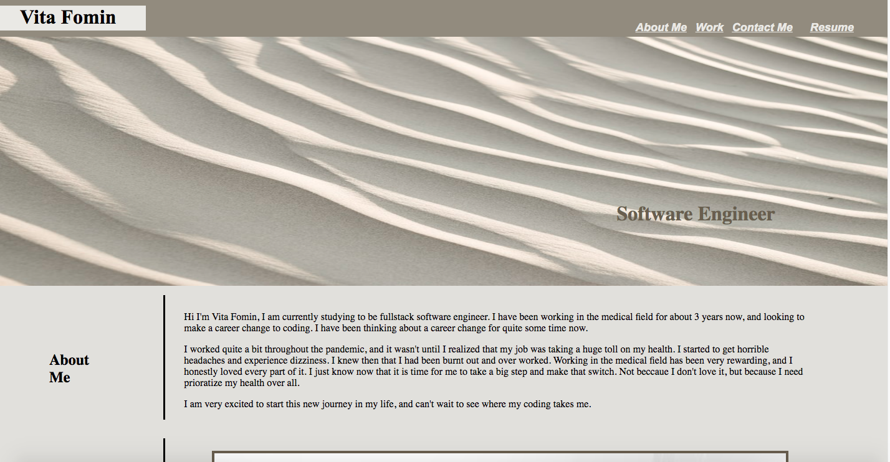

# challenge-2-professional-portfolio

## Description
In this challenge I created a professional portfolio webpage. When the webpage is loaded it presents my name, a photo, and links to sections. These sections contain about me, my work, and how to contact me. When you click on the links in the nav bar the page scrolls to the corresponting section that you click on. My work secion on presents titled images of my application, and my first application is bigger compared to the others. Each of the images have links that take you to the deployed application when it is clicked. Finally, the page is adaptable to various screen sizes.  

## Installation

N/A

## Usage

This challenge allowed me to make a professional portfolio. Having this portfolio will allow me to present myself to future potential employers. In this portfolio I included all the the sections that can make me stand out, and land a job.

(https://vitafomin.github.io/challenge-2-professional-portfolio/)

## Credits

N/A

## License

Please refer to the LICENSE in the repo

